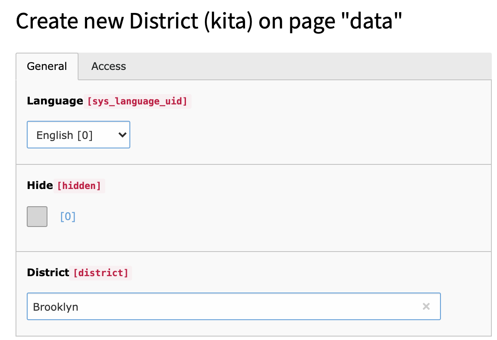
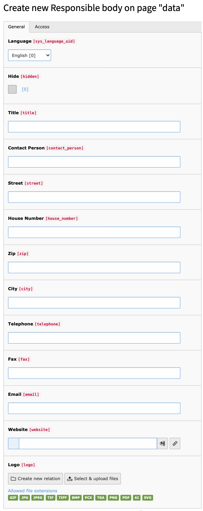

..  include:: /Includes.rst.txt

..  _for-editors:

===========
For Editors
===========

Let's add some district records
===============================

The first required thing is at least one district record. Later we will use
this districts for the Kita records.

Who is responsible?
===================

Each kita needs a responsible. This can be for example a city or a church.
Create at least one responsible body record.

Finally add kita records
========================

Now it's time to create the kita records. Type in all the information about
that kita and select the associated district and responsible body.

..  tip::

    The newly added kita appears in the list as soon as you save the record
    except check that "hide" checkbox.
